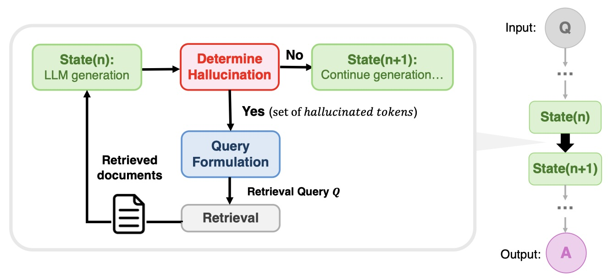

# Reasoning-Confidence Guided Search For Multi-Hop Question Answering
## Project Description
This is my research project for POSTECH CSED499A.
* Advised by Wook-Shin Han 
* Data Systems Lab @ POSTECH  
This project investigates the application of the Retrieval-Augmented Generation (RAG) framework for multi-hop question answering (QA), where multiple documents need to be read and multi-step reasoning is required to generate an answer.  
  
## Background
While prompting Large Language Models (LLMs) for inference generation has been proposed, it is only effective when the LLM possesses sufficient knowledge. To address knowledge gaps, the RAG framework incorporates external databases for information retrieval.
  
## Research Objectives
1. **Identify problems in Existing Methods**: Analyze existing RAG frameworks to identify their shortcomings.
2. **Propose Solutions**: Develop a concrete plan to improve performance and efficiency.
  
## Baseline and State-of-the-Art Methods
- **Baseline**: Fixed method alternating between retrieval and generation.
- *** [IRCoT (ACL 2023)][https://arxiv.org/abs/2212.10509]
- **State-of-the-Art (SOTA)**: Identifies moments when the LLM lacks knowledge and needs to search for additional information, constructing queries accordingly. While this improved performance and efficiency, it relied on a heuristic that low generation probabilities indicated hallucination and only considered previously generated tokens for query construction, failing to capture semantic meaning.
- *** [DRAGIN (ACL 2024)][https://arxiv.org/abs/2403.10081]
  
## Proposed Approach
We structured the multi-hop QA task as a search process where the model traverses inference states to reach an answer. If hallucination is detected in the generation result, the model backtracks to regenerate correct inferences.

</img>  

### Improvements in Query Construction
1. **Attention to Full Context**: Instead of considering only the preceding tokens, the model uses attention to the entire context of the generated result.
2. **Semantic Meaning in Queries**: Prompt the LLM to generate queries in question form to better capture semantic meaning, particularly for incorrect tokens.
